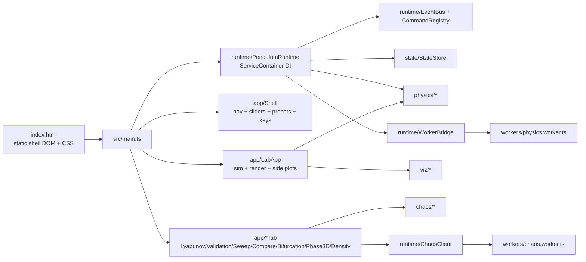

# Architecture

Pendulum Lab V10 is a **100% TypeScript** application. The original ~8,080-line legacy
`js/` runtime has been fully removed (archived under `archive/`); `index.html` loads only
`src/main.ts` plus the hand-written CSS that styles the static shell DOM. A single
dependency-injection container (`runtime/ServiceContainer`, exposed as
`window.PendulumRuntime`) is the canonical source of truth for every runtime service.

## Layered Architecture

The codebase is split into a **domain layer** (pure, browser-free, deterministic) and an
**infrastructure layer** (DOM, workers, globals, browser APIs). The domain layer never
imports the infrastructure layer, which keeps the physics/chaos engine unit-testable in
Node and reusable outside the browser.

| Layer | Packages | May depend on | Must NOT depend on |
|---|---|---|---|
| Domain (pure) | `physics/`, `chaos/`, `viz/` (math), `validation/` (checks), `export/manifest` | other domain modules, `types/` | DOM, `window`, workers, `runtime/` |
| Application/runtime | `runtime/ServiceContainer`, `runtime/PendulumRuntime`, `EventBus`, `CommandRegistry`, `StateStore`, `app/Shell`, `app/LabApp`, `app/*Tab` | domain layer, `types/` | DOM specifics leaking into domain |
| Infrastructure | `runtime/*Bridge`, `render/performance`, `ui/`, `workers/` | application + domain | — |

The legacy `js/` runtime has been removed (see `archive/`); the `runtime/LegacyBridge` and
`runtime/IndexPhysicsBridge` remain only as inert, guarded compatibility shims (they no-op
when no legacy runtime is present) and can be deleted in a future cleanup.

## Dependency Injection Container

`ServiceContainer<M>` is a zero-dependency typed container: lazy singletons by default,
optional transients, throwing `resolve` plus non-throwing `tryResolve`, and a typed
service map `PendulumServiceMap`. `installPendulumRuntime()` registers `events`,
`commands`, `state`, `physics`, `worker`, and adopts the legacy `legacyApp` / `legacyPhysics`,
then freezes the public surface onto `window.PendulumRuntime`. Modern modules resolve
collaborators from the container instead of reading ambient globals.

## Module Boundaries

- `src/app/`: the modern Lab application layer — `LabSimulation` (headless integration core driving the typed `physicsAdapter`), `LabRenderer` (canvas pendulum renderer targeting the structural `Ctx2D`, legacy-parity geometry: pivot at `w/2, h·0.38`, 110 px/m), `LabController` (`mountModernLab`, an independently-mountable rAF loop), and `LabApp` (the full lab tab: loop + energy/Lyapunov/phase/Poincaré/FFT side plots + control wiring + legacy takeover). Analysis helpers: `fft`, `PoincareAccumulator`, `LyapunovEstimator`, `labPlots`. Mounted behind `?modernLabProbe` (standalone probe) and `?lab=modern` (real-canvas takeover).
- `src/physics/`: typed equations, energy helpers, integrator metadata, and pure integrator implementations.
- `src/state/`: strict StateStore snapshot validation, state synchronization, and import-safe runtime patches.
- `src/runtime/`: central event bus, command registry, legacy onclick migration, and module worker bridge.
- `src/ui/`: safe DOM helpers and accessibility upgrades.
- `src/validation/`: deterministic validation checks and strict JSON import parsing.
- `src/export/`: typed submission manifest and report export helpers.
- `src/render/`: runtime metric probes for FPS, physics time, memory, and worker latency.
- `src/workers/`: separate module worker with main-thread fallback through `WorkerBridge`.
- `index.html`: the single user-facing simulator page (static shell DOM + CSS); it loads `src/main.ts`, which boots the runtime, Lab, analysis tabs, and shell.

## Public API Surface (minimized)

Exactly one frozen object is published for the modern runtime: `window.PendulumRuntime`
(`{ version, container, resolve, tryResolve, has, events, commands, state, describe }`),
plus `window.PendulumLabIndex` (the command-registry runtime surface used by the export
commands). The Lab and analysis tab controllers are reachable for tooling via
`window.__modernLab` and `window.__modernTabs`. No bare runtime globals are written.

## Legacy Removal (complete)

The migration ran in four verifiable stages, each keeping `npm run typecheck`, `npm test`,
the Playwright e2e suite, and `npm run audit:legacy` green so the legacy-risk score only
ever moved down (482 → 0):

1. **Runtime unification.** Single DI container; the five legacy globals collapsed to one
   namespace + read-only accessors; dynamic `<script>` injection removed.
2. **Modern Lab as default.** `src/app/LabApp` drives the lab tab — simulation loop, all
   side plots, controls, presets, ensemble, FX, drag-to-set, export, and replay.
3. **Analysis tabs.** Lyapunov, Validation, Sweep, Compare, Bifurcation, 3D-phase, and
   density were each ported (taking over their controls by cloning the buttons to drop the
   legacy handlers) and covered by unit + e2e tests.
4. **Shell + cut.** `src/app/Shell` took over navigation, slider displays, presets, and
   keyboard shortcuts; audio was ported (`AudioSonifier`); `LabApp` took over the header
   chrome. The legacy `<script>` tags were removed from `index.html` and `js/00`–`js/11`
   moved to `archive/`. The app is now served entirely from `src/` via Vite.

The `runtime/LegacyBridge` and `runtime/IndexPhysicsBridge` survive as inert, guarded
compatibility shims (they no-op without a legacy runtime) and may be deleted later.
